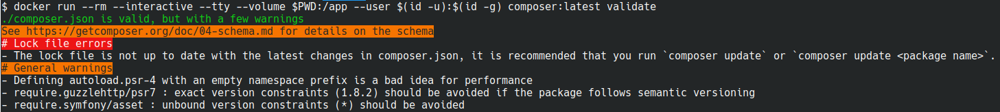

# composer validate

Cette commande de Composer permet de valider le format et le contenu du fichier `composer.json`.

# Paramètres

Les paramètres sont visibles pour votre version de Composer via `composer validate --help`
ou via [la documentation officielle](https://getcomposer.org/doc/03-cli.md#validate).

En résumé vous pouvez désactiver certaines vérifications
(via `--no-check-all`, `--no-check-lock` et `--no-check-publish`),
valider les `composer.json` des dépendances (via `--with-dependencies`)
et traiter les warnings comme des erreurs (via `--strict`).

# Utilisation

Cette commande ne requiert pas d'être dans le contexte de votre projet pour fonctionner 
(extensions PHP installées, `composer install` effectué etc) donc il est très facile de la lancer via Docker :

```bash
docker run --rm --interactive --tty --volume $(pwd):/app --user $(id -u):$(id -g) composer:latest validate
```

Quelques exemples de retours possibles :



# Sources

[getcomposer.org](https://getcomposer.org/doc/03-cli.md#validate)
