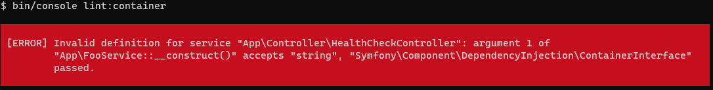

# Build du Container de Symfony

Le Container de Symfony est buildé avant tout dans `var/cache/env/ContainerFoo` depuis les fichiers de configurations et les CompilerPass.

On pourrait penser que la compilation vérifie absolument tout pour que le Container puisse être buildé : c'est presque le cas.

Cette mise en cache vérifie par exemple (liste non exhaustive) :
 * La classe du service existe
 * Le bon nombre de paramètres indiqués dans `__construct()` est configuré ou l'autowire peut les trouver tout seul
 * Même chose pour les [calls](https://symfony.com/doc/current/service_container/calls.html)

Mais il y a une chose qu'il ne fait pas au moment du build : vérifier que le type de chaque paramètre qui est demandé dans le code est bien celui que le Container va injecter.

D'après Symfony, effectuer cette vérification au moment du build du Container prendrait énormément de temps et diminuerait les performances lors de la génération du cache.

# Exemple

Voilà un exemple de service mal configuré qui n'empêche pas le build du Container :
```php
declare(strict_types=1);

namespace App;

class FooService
{
    public function __construct(string $foo)
    {
    }
}
```

Configuration dans `config/services.yaml` :
```yaml
services:
    App\FooService:
        bind:
            $foo: "@service_container"

```

Injection de `FooService` :
```yaml
declare(strict_types=1);

namespace App\Controller;

class FooController
{
    public function __construct(FooService $fooService)
    {
    }
}
```

On voit que `FooService::__construct()` attend une injection pour `$foo` de type `string`,
alors que la configuration de l'injection de dépendance va lui envoyer une instance du service `@service_container`.

Dans ce cas FooController ne peut pas être instancié, on aura cette erreur :
```
Argument 1 passed to App\\FooService::__construct() must be of the type string, object given, called in /app/var/cache/dev/ContainerGM2E9nN/App_KernelDevDebugContainer.php on line 573
```

Ce n'est pas le seul cas qui n'est pas détecté à la compilation du Container,
voir [Service Container Linter](https://symfony.com/blog/new-in-symfony-4-4-service-container-linter) 
pour un exemple des autres cas gérés.

# Détecter ces erreurs via lint:container

Le bundle [FrameworkBundle](https://github.com/symfony/framework-bundle) de Symfony contient une commande très intéressante : `lint:container`.

Le container arrive bien à se builder malgré ces erreurs, donc la commande peut être lancée dans notre projet même si il y a cette erreur.

L'erreur est bien remontée par `lint:container` :



Cette commande aura un exit code à `1` en cas d'erreur et `0` quand tout va bien : elle est donc pleinement utilisable dans un job de CI.

# Détecter ces erreurs via CheckTypeDeclarationsPass

# Références

[Documenttion Symfony](https://symfony.com/blog/new-in-symfony-4-4-service-container-linter)
