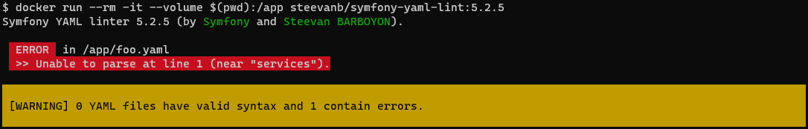
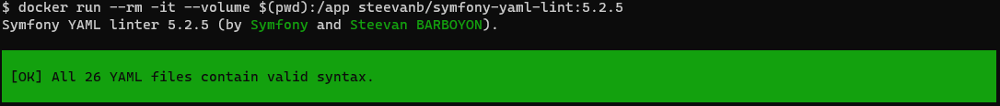

# lint:yaml

La commande `lint:yaml` du dépôt [symfony/yaml](https://github.com/symfony/yaml) permet de vérifier la syntaxe de fichiers YAML.

Dans l'idée, cette commande n'a que peu d'intérêt sur les fichiers de config de Symfony (`/config`) : comme ils seront lus pour générer le cache du Container, indispensable pour faire fonctionner la commande, si il y a une erreur de syntaxe une exception surviendra avant que la commande ne vérifie les fichiers YAML.

Cependant d'autres cas peuvent être intéressants à tester :
 * Autres fichiers YAML, par exemple les fichiers de traduction
 * Si vous n'êtes pas dans un contexte Symfony et que vous ne faites qu'utiliser le composant [symfony/yaml](https://github.com/symfony/yaml)
 * Si vous êtes dans un contexte Symfony mais que vous lancez la commande `symfony:yaml` depuis une image Docker séparée de votre projet (exemple : [steevanb/docker-symfony-yaml-lint](https://github.com/steevanb/docker-symfony-yaml-lint))

# Exemple avec Docker

L'image Docker [steevanb/symfony-yaml-lint](https://hub.docker.com/repository/docker/steevanb/symfony-yaml-lint) vous permet de lancer `lint:yaml` sur votre projet sans installer le composant [symfony/yaml](https://github.com/symfony/yaml).

Tous les fichiers YAML dans le répertoire `/app` du Container seront validés.

## Exemple
```bash
docker run --rm -it --volume $(pwd):/app steevanb/symfony-yaml-lint:5.2.5
```

### Résultat : fichier YAML avec une erreur de syntaxe

Fichier YAML avec une erreur (il manque `:` après `services`) :
```yaml
services
    foo
```


### Résultat : pas d'erreur de syntaxe



## Exemple avec configuration

Vous pouvez configurer la commande via des variables d'env :
 * `LINT_YAML_PARAMETERS` : paramètres à passer à la commande `lint:yaml`
 * `LINT_YAML_BOOTSTRAP` : fichier PHP à inclure avant d'exécuter la commande `lint:yaml`
 * `LINT_YAML_PHP_PARAMETERS` : paramètres de la commande `php`
 * `LINT_YAML_DIRECTORY` : répertoire dans lequel seront vérifiés les fichiers YAML

```bash
docker \
    run \
        --rm \
        -it \
        --volume $(pwd):/app \
        --env LINT_YAML_PARAMETERS="--parse-tags --exclude=/app/vendor" \
        --env LINT_YAML_BOOTSTRAP="/app/lintYaml.bootstrap.php" \
        --env LINT_YAML_PHP_PARAMETERS="-d memory_limit=250M" \
        --env LINT_YAML_DIRECTORY="/foo" \
        steevanb/symfony-yaml-lint:5.2.5
```

# Références

[symfony/yaml](https://github.com/symfony/yaml)

[How to find errors in translation files](https://symfony.com/doc/current/translation/lint.html)

[steevanb/docker-symfony-yaml-lint](https://github.com/steevanb/docker-symfony-yaml-lint)

[steevanb/symfony-yaml-lint](https://hub.docker.com/repository/docker/steevanb/symfony-yaml-lint)
