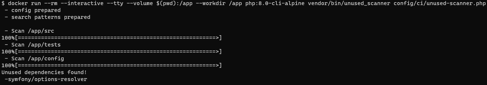

# unused-scanner

[insolita/unused-scanner](https://github.com/Insolita/unused-scanner)
permet de vérifier qu'on n'a pas de dépendances dans notre `composer.json` qui ne sont pas utilisées dans le code.

# Utilisation

Cette commande ne requiert pas d'être dans le contexte de votre projet pour fonctionner 
(extensions PHP installées, `composer install` effectué etc) donc il est très facile de la lancer.

## Installée dans les dépendances globales de Composer

```bash
unused_scanner config/ci/unused-scanner.php
```

## Installée dans votre projet

```bash
docker run --rm --interactive --tty --volume $(pwd):/app --workdir /app php:8.0-cli-alpine vendor/bin/unused_scanner config/ci/unused-scanner.php
```

## Exemples de retours possibles



# Paramètres

Aucun paramètre n'est disponible pour cet outil, pas même de `-v` ou `--help`.

Le seul paramètre, qui est obligatoire, est le chemin vers le fichier de configuration.

# Répertoires scannés

On peut configurer plusieurs répertoires dans lesquels `unused-scanner` va chercher notre code.

Il peut arriver qu'on indique plusieurs répertoires et que certains ne soient pas scannés :
c'est quand `unused-scanner` a déjà trouvé une utilisation de toutes les dépendances dans les répertoires précédents,
il ne va pas chercher dans les suivants.

# Sources

[insolita/unused-scanner](https://github.com/Insolita/unused-scanner)
