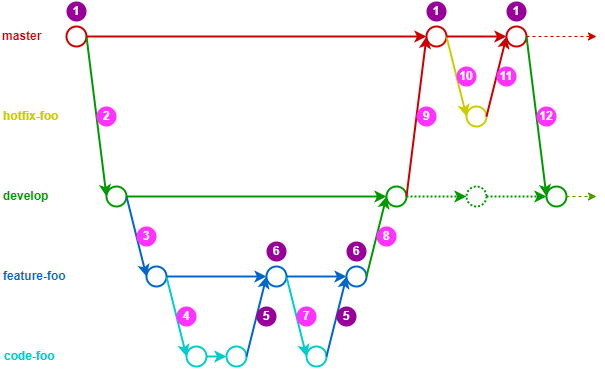

# Présentation

L'utilisation de git ne se résume pas à un schéma de branches fixes que tout le monde utilise.

Chaque projet a ses propres besoins et en fonction de la taille de l'équipe, si il y a une équipe de QA ou pas, 
des façons de faire peuvent s'appliquer plus ou moins facilement.

Je vais vous présenter ici un workflow qui est inspiré de
[git flow](https://danielkummer.github.io/git-flow-cheatsheet/index.fr_FR.html).

Git flow est un bon outil, mais à mon sens il ne prévoit pas que le code soit revu et mergé 
via un outil comme GitLab ou Github.

# Schéma

 1. Le dernier commit mergé sur `master` depuis `develop` ou `hotfix-foo` doit être automatiquement taggé et livré en production 
 2. Création de la branche `develop` depuis `master`, aucun développement directement sur develop
 3. Pour commencer une feature, on crée une branche `feature-foo` depuis `develop` : on ne code pas directement sur `feature-foo`
 4. On créé une branche `code-foo` depuis `feature-foo` pour coder l'intégralité d'un ticket
 5. On demande la revue de code technique, quand elle est validée `code-foo` est mergée sur `feature-foo`
 6. Déploiement automatisé de `feature-foo` sur un serveur pour être validé par la QA (tests fonctionnels) et le PO (toutes les demandes ont bien été traitées)
 7. Si la la QA ou le PO n'a pas validé, on refait une branche `code-foo` pour effectuer les corrections
 8. Une fois que la feature a été validée techniquement (étape 5), par la QA et le PO (étape 6), elle peut être mergée sur `develop`
 9. Tout merge sur `develop` doit être mergé au plus vite sur `master`, pour ne pas avoir plusieurs features mergées sur `develop` mais pas sur `master`
 10. En cas de hotfix, on crée une branche `hotfix-foo` depuis `master`
 11. Revue de code technique, et en fonction de la criticité et de la rapidité de la correction, validation de la QA et du PO
 12. Une fois le hotfix mergé sur `master`, il faut rebase (et pas merge) `develop` de `master` pour récupérer le commit de hotfix sans changer son identifiant

# Droits

## master et develop
Les branches `master`, `develop` et `feature-foo` doivent être protégées :
on doit passer par une merge request pour ajouter du code sur ces branches.

`master` doit impérativement bloquer toute tentative de `git push --force`,
ce qui recréerait une partie des commits et potentiellement changerait des identifiants de commit.

`develop` doit bloquer les `git push --force` sauf dans le cas d'un hotfix (étape 12) quand on rebase `develop` de `master`.

## feature-foo

`feature-foo` devrait bloquer les `git push --force` pour éviter toute erreur manuelle, mais dans l'idée,
on peut en faire si on en a besoin.
Tant que cette branche n'est pas mergée sur `develop` on peut faire ce que l'on veut dessus.

## hotfix-foo et code-foo

Vu qu'elles seront mergées et supprimées, ces branches n'ont pas de restrictions,
on peut faire ce que l'on veut dessus : `git push --force`, `git commit --amend` etc.

# Quelques idées clés

## master et `develop`

Les branches `master` et `develop` sont les deux seules branches qui vont rester en vie durant tout votre projet.

 * Elles ne doivent jamais être supprimées
 * Les identifiants de commit sur `master` et sur `develop` doivent être les mêmes pour certifier qu'on a bien les mêmes commits
 * Tous les tags pour les livraisons en prod seront fait sur `master`
 * Une branche mergée sur `develop` doit être mergée sur `master` et partir en production aussi vite que possible
 * Il faut éviter au maximum d'avoir plusieurs features mergées sur `develop` mais pas sur `master`
 
## A quoi sert `develop` ?

Cette branche existe uniquement pour qu'un hotfix puisse être fait depuis la version en production 
(donc la branche `master`) tout en conservant son identifiant de commit entre `master` et `develop`.

Sans cette branche develop, si on doit faire un hotfix et que du code est déjà mergé sur master,
alors la prochaine livraison contiendra notre hotfix + du code d'une feature qu'on ne veut sûrement pas livrer 
en même temps qu'un hotfix.  

## Pas de / dans le nom des branches

Si vous mettez un `/` dans le nom d'une branche, pour git, c'est un répertoire qui sera créé dans `.git/branches`.

Exemples :
 * Pour branche `feature-foo`, git va créer le fichier `.git/branches/feature-foo`
 * Pour une branche `feature/foo`, git va créer le fichier `.git/branches/feature/foo`

Ca peut être bloquant si vous créez une branche `feature/foo`, vous ne pourrez ensuite plus créer de branche `feature`
parce qu'il sera impossible de créer un fichier qui a le même nom que le répertoire précédement créé.

Pour éviter d'avoir ce genre de problèmes et de devoir supprimer manuellement des répertoires dans le répertoire `.git`,
évitez de mettre des `/` dans le nom des branches.

# Rérérences

[git flow](https://danielkummer.github.io/git-flow-cheatsheet/index.fr_FR.html)
