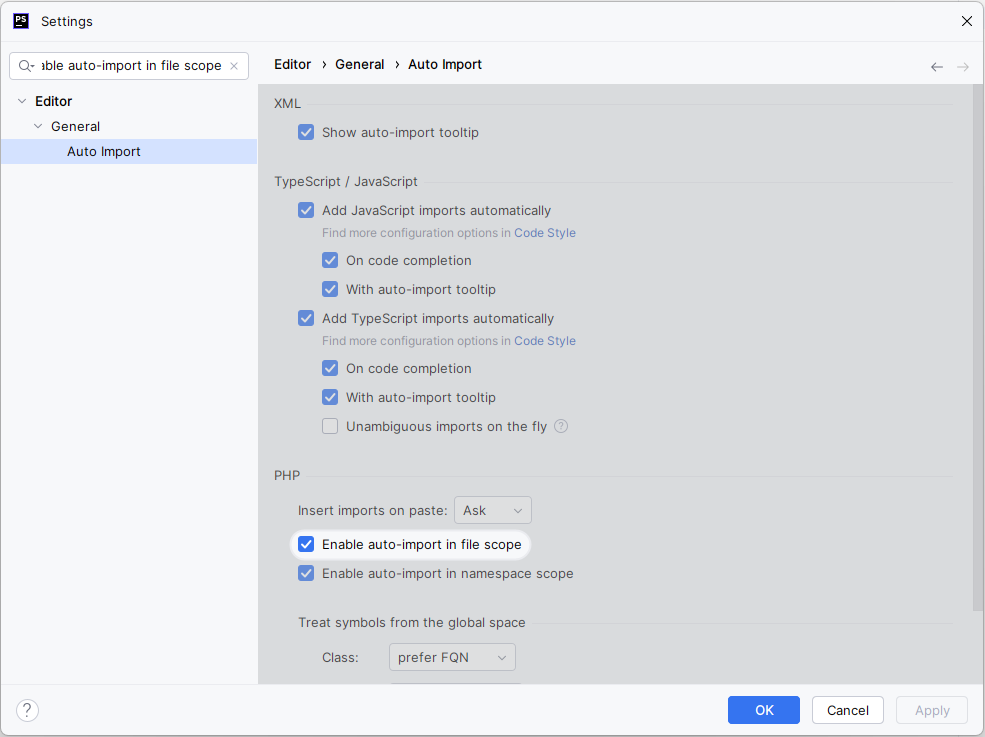

Lorsque vous êtes dans un fichier PHP qui n'a pas de namespace, si vous voulez utiliser une classe qui est dans un
namespace, alors PHPStorm va écrire le FQCN dans le code au lieu d'ajouter un use et de n'utiliser que le nom de la
classe.

Exemple :
```php
<?php

\App\Controller\Container\ListContainersController::class;
```

Pour corriger ce comportement, voilà l'option de configuration à cocher, en cherchant `enable auto-import` :



Avec la configuration activée :
```php
<?php

use App\Controller\Container\ListContainersController;

ListContainersController::class;
```
