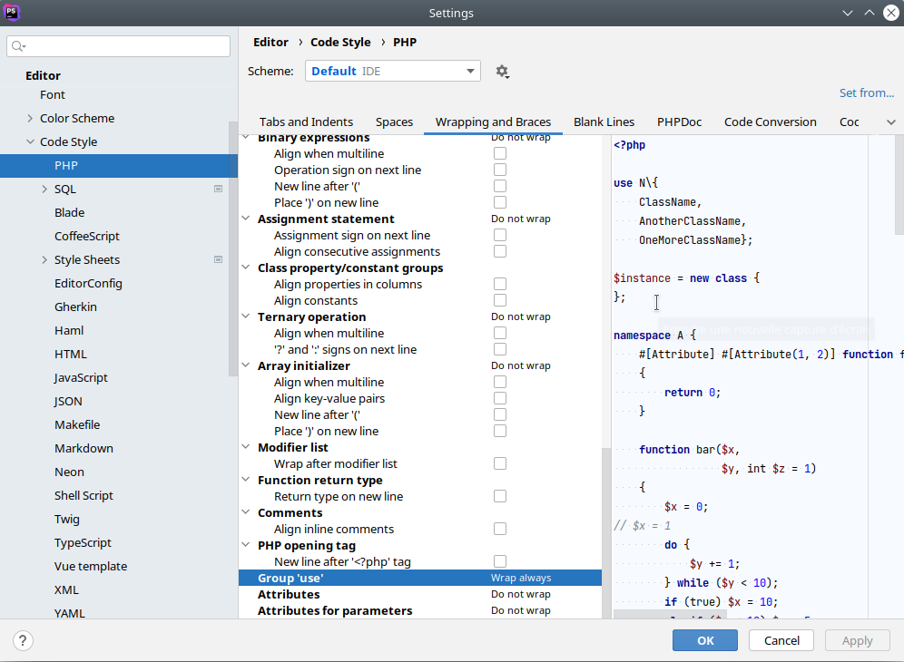

# Retour à la ligne après l'accolade ouvrante

Par défaut PHPStorm met un retour à la ligne après l'accolade ouvrante du regroupement des uses
uniquement si la ligne dépasse un certain nombre de caractères :

```php
use Foo\{Bar, Baz};
```

Il y a une configuration pour indiquer quel comportement on veut :



En la mettant sur `Wrap always` vous aurez toujours un retour à la ligne quelle que soit la longueur de la ligne :

```php
use Foo\{
    Bar,
    Baz};
```

Malheureusement je n'ai pas trouvé de configuration pour avoir un retour à la ligne avant l'accolade fermante,
il faut le faire à la main.

# Sources

[Billy Villena](https://github.com/edhrendal) qui a trouvé cette configuration
