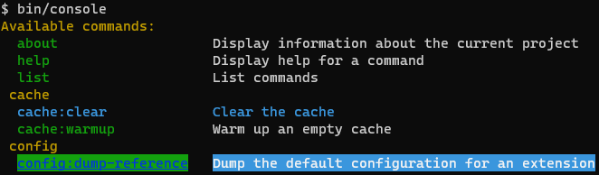

# huttopia/console-bundle

Le bundle [huttopia/console-bundle](https://github.com/Huttopia/console-bundle) permet d'ajouter ces fonctionnalités
au composant [symfony/console](https://symfony.com/doc/current/components/console.html) :
 * Supprimer des commandes en fonction de l'environnement Symfony
 * Cacher des parties lors d'un `bin/console` (liste des commandes) pour simplifier l'affichage
 * Coloriser des commandes dans la liste pour les faire ressortir
 * Surcharge de `doctrine:schema:update` pour l'exécuter sur plusieurs bases de données

# Cacher des commandes en fonction de l'environnement

De base, Symfony vous permet de cacher des commandes ([How to Hide Console Commands](https://symfony.com/doc/current/console/hide_commands.html)) 
mais cette fonctionnalité a 2 défauts majeurs :
 * C'est la commande qui définit si elle est cachée ou non, donc ce n'est pas configurable pour des commandes qui ne sont pas dans notre projet
 * La commande n'est que `cachée` de la liste des commandes mais on peut encore l'exécuter en l'appelant directement

[huttopia/console-bundle](https://github.com/Huttopia/console-bundle) corrige ces 2 choses.

Les commandes à `supprimer` (et pas `cacher`) 
sont configurables via `config/packages/console.yaml` (et bien sûr par environnement via `config/packages/prod/console.yaml` par exemple).

On peut par exemple supprimer la commande `doctrine:schema:update` en prod et ainsi empêcher son exécution.

# Coloriser des commandes dans la liste pour les faire ressortir

Certaines commandes sont plus utilisées que d'autres, et au fur et à mesure que votre projet avancera 
vous aurez probablement de plus en plus de commandes dans la liste via `bin/console`.

Vous pouvez changer le style d'affichage des commandes pour les faire ressortir :

# Rérérences

[huttopia/console-bundle](https://github.com/Huttopia/console-bundle)

[Demande de fonctionnalité à Symfony](https://github.com/symfony/symfony/issues/22645)
